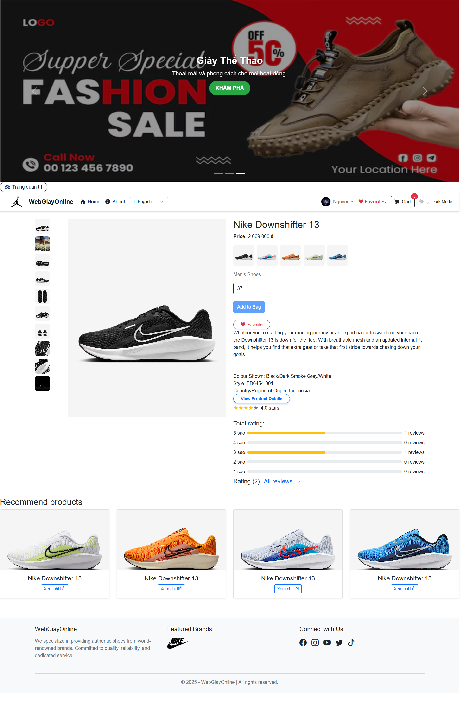
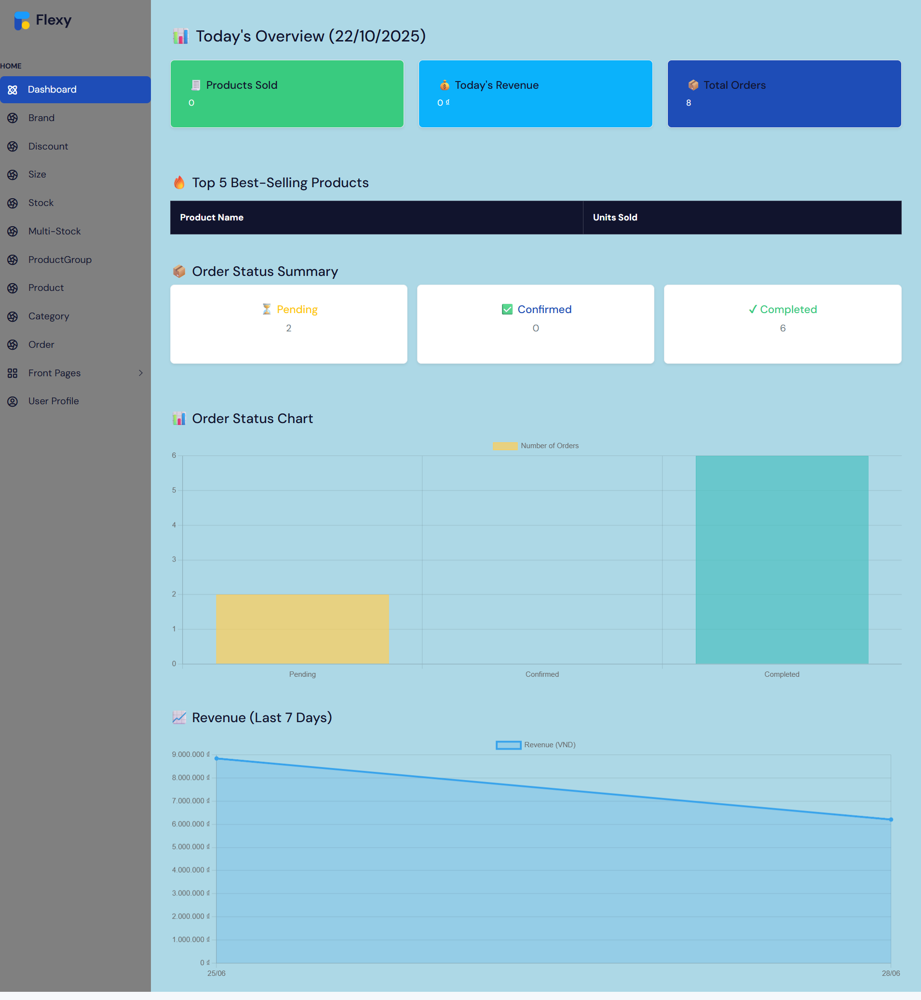

# 👟 WebGiay – Website Bán Giày (.NET MVC)

Website bán giày được phát triển bằng **ASP.NET MVC** và **SQL Server**, có các tính năng như đăng nhập Google, phân quyền Admin/Customer, tìm kiếm bằng giọng nói, đa ngôn ngữ (Anh – Việt) và thanh toán MoMo.

---

## 🧩 Tính năng chính
- 🔐 Đăng ký / đăng nhập (Google, quên mật khẩu)  
- 👥 Phân quyền **Admin / Customer**  
- 🔎 **Autocomplete + tìm kiếm bằng giọng nói**  
- 🌍 **Đa ngôn ngữ:** Anh / Việt  
- 💬 **Đánh giá sản phẩm, giảm giá, lọc theo giá & giới tính**  
- 🤖 **AI gợi ý sản phẩm** (API tích hợp)  
- 💳 **Thanh toán MoMo**, quản lý kho, lưu ảnh với **Cloudinary**

---

## ⚙️ Công nghệ sử dụng
**ASP.NET MVC**, **SQL Server**, **Cloudinary**, **Google OAuth**, **MoMo API**, **Bootstrap**, **jQuery**

---

## 📸 Giao diện minh họa

| Trang chủ | Trang sản phẩm | Trang quản trị |
|------------|----------------|----------------|
|  |  |  |

> *(Hãy lưu ảnh chụp màn hình thật của bạn vào thư mục `/screenshots/` trong repo)*

---

## 👨‍💻 Vai trò cá nhân
Phát triển toàn bộ **frontend**, **backend**, **database**, và **bảo mật**.  
Sử dụng **AI (ChatGPT)** để tham khảo, sửa lỗi và tối ưu code trong quá trình xây dựng hệ thống.

---

## 🔗 Liên kết
- **GitHub Repository:** [github.com/nguathan7x/WebGiay](https://github.com/nguathan7x/WebGiay)
- **Liên hệ:** Trần Thị Ánh Nguyên – Sinh viên CNTT, Đại học HUTECH (GPA 3.5/4.0)

---

> “Tôi tin rằng công nghệ không chỉ là công cụ, mà là cách tạo ra giá trị thực cho con người.”
